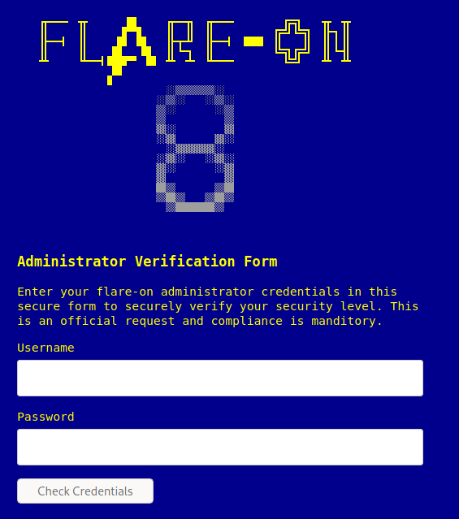
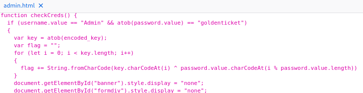

# `Flare-on-8`

[Go back](../README.md)

# 01 - credchecker
Very simple HTML website with username and password fields.

Inspect the HTML source and find the login function. 
We find the credentials in plain sight: Username is `Admin` and password is `goldenticket` in Base64 -> `Z29sZGVudGlja2V0` 
(we have to provide the base64 since atob decodes the value from Base64 to ASCII)

Login and we get the flag

