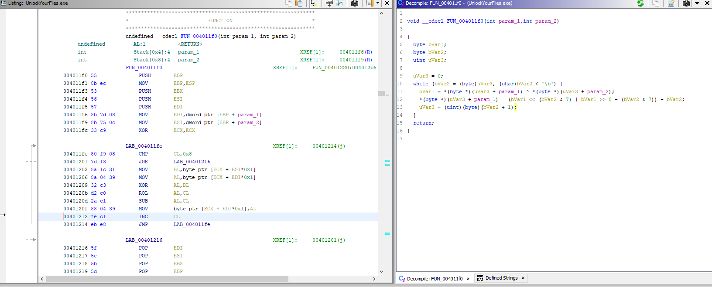
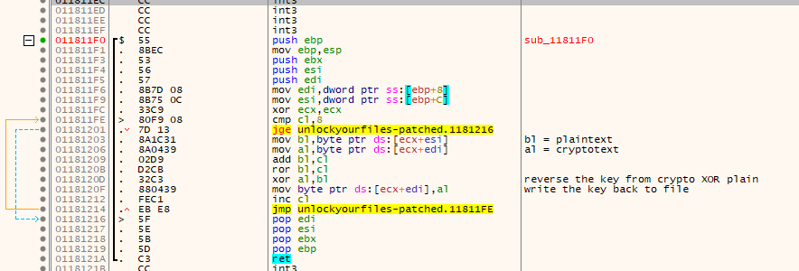

# `Flare-on-8`

[Go back](../README.md)<hr/>

## 02 - known
We are provided with encrypted files and a decryptor executable.<br>
```
**********
Attention!
**********

Your documents, photos, and other important files have been encrypted with a strong algorithm.

Don't try and change file extensions! It can be dangerous for the encrypted information!

The only way to recover (decrypt) your files is to run this decryptor with the unique private key.
Attention! Only we can recover your files! If someone tell you that he can do this, kindly ask him to proof!

Below you will see a big base64 blob, you will need to email us and copy this blob to us.
You must pay all but 1 BTC to 48 hours for recover it. After 48 hours we will leaked all your data!

KD4wXzApPiBJdCdzIGRhbmdlcm91cyB0byBhZGQrcm9yIGFsb25lISBUYWtlIHRoaXMgPCgwXzA8KQo=

Enter the decryption key and press Enter: 
```
The Base64 string is a hint<br>
```
KD4wXzApPiBJdCdzIGRhbmdlcm91cyB0byBhZGQrcm9yIGFsb25lISBUYWtlIHRoaXMgPCgwXzA8KQo=
```
decoding it gives us:
```
(>0_0)> It's dangerous to add+ror alone! Take this <(0_0<).
```
Reversing the executable reveals the decryption is a simple XOR ROL SUB operation.<br>
The file `latin_alphabet.txt` allows us to simply ADD ROR XOR the contents with the actual alphabet, and we get the encryption key back as a result: `No1Trust`<br>
We then decrypt the other files, the flag is in `critical_data.txt`<br>
`(>0_0)> You_Have_Awakened_Me_Too_Soon_EXE@flare-on.com <(0_0<)`

<hr>

Decryption algorithm


We can simply patch and reuse the decryptor to get the key back

