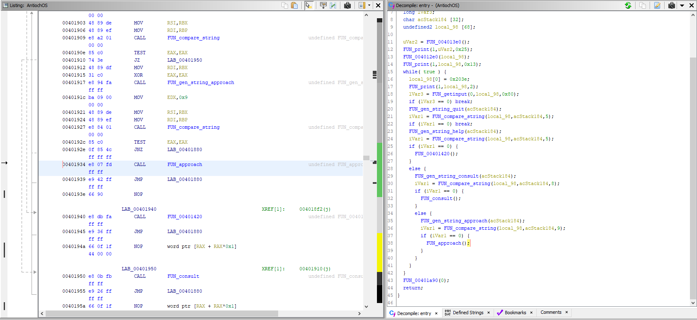
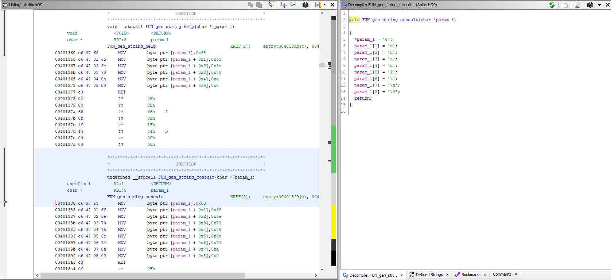

# `Flare-on-8`

[Go back](../README.md)<hr/>

# 03 - antioch

`antioch.tar` is a docker image but layers history seems to be missing.<br>
Latest layer contains an ELF executable, which doesn't tell much about itself...
```
AntiochOS, version 1.32 (build 1975)
Type help for help
> help
Available commands:
help: print this help
...AAARGH
```

By reversing we figure out the input is compared with two other strings (which on ghidra aren't immediately visible, function parameter has to be retyped to show characters)




So the ELF has two functions:
1) `approach` -> tells us the order of the layers
2) `consult` -> shows us the flag

To view the flag we have to reorder the layers (otherwise we get nothing).<br>
Each layer contains an author which we will need to use in the first function.

Let's create a script to extract the authors ([script](authors.py))

```
0   antiochmod/e5254dec4c7d10c15e16b41994ca3cf0c5e2b2a56c9d4dc2ef053eeff24333ff/json -> 0 Author: Brother Maynard
1   antiochmod/ea12384be264c32ec1db0986247a8d4b2231bf017742313c01b05a7e431d9c26/json -> 1 Author: Sir Bors
2   antiochmod/fadf53f0ae11908b89dffc3123e662d31176b0bb047182bfec51845d1e81beb9/json -> 2 Author: Inspector End Of Film
3   antiochmod/81f28623cca429f9914e21790722d0351737f8ad3e823619a4f7019be72e2195/json -> 3 Author: Squire Concorde
4   antiochmod/2b363180ec5d5862b2a348db3069b51d79d4e7a277d5cf5e4afe2a54fc04730e/json -> 4 Author: Dennis the Peasant
5   antiochmod/76531a907cdecf03c8ac404d91cbcabd438a226161e621fab103a920600372a8/json -> 5 Author: Green Knight
6   antiochmod/09e6fff53d6496d170aaa9bc88bd39e17c8e5c13ee9066935b089ab0312635ef/json -> 6 Author: Dragon of Angnor
7   antiochmod/cfd7ddb31ce44bb24b373645876ac7ea372da1f3f31758f2321cc8f5b29884fb/json -> 7 Author: Black Knight
8   antiochmod/7d643931f34d73776e9169551798e1c4ca3b4c37b730143e88171292dbe99264/json -> 8 Author: Sir Bedevere
9   antiochmod/f9621328166de01de73b4044edb9030b3ad3d5dbc61c0b79e26f177e9123d184/json -> 9 Author: Bridge Keeper
10   antiochmod/b75ea3e81881c5d36261f64d467c7eb87cd694c85dd15df946601330f36763a4/json -> 10 Author: Miss Islington
11   antiochmod/754ee87063ee108c1f939cd3a28980a03b700f3c3967df8058831edad2743fd7/json -> 11 Author: Sir Robin
12   antiochmod/e6c2557dc0ff4173baee856cbc5641d5b19706ddb4368556fcdb046f36efd2e2/json -> 12 Author: King Arthur
13   antiochmod/e1a9333f9eccfeae42acec6ac459b9025fe6097c065ffeefe5210867e1e2317d/json -> 13 Author: Prince Herbert
14   antiochmod/bfefc1bdf8b980a525f58da1550b56daa67bae66b56e49b993fff139faa1472c/json -> 14 Author: Chicken of Bristol
15   antiochmod/f2ebdc667cbafc2725421d3c02babc957da2370fbd019a9e1993d8b0409f86dd/json -> 15 Author: Squire Patsy
16   antiochmod/4c33f90f25ea2ab1352efb77794ecc424883181cf8e6644946255738ac9f5dbd/json -> 16 Author: Tim the Enchanter
17   antiochmod/1c5d28d6564aed0316526e8bb2d79a436b45530d2493967c8083fea2b2e518ce/json -> 17 Author: Roger the Shrubber
18   antiochmod/a435765bcd8745561460979b270878a3e7c729fae46d9e878f4c2d42e5096a44/json -> 18 Author: Lady of the Lake
19   antiochmod/25e171d6ac47c26159b26cd192a90d5d37e733eb16e68d3579df364908db30f2/json -> 19 Author: Dinky
20   antiochmod/a2de31788db95838a986271665b958ac888d78559aa07e55d2a98fc3baecf6e6/json -> 20 Author: Sir Gallahad
21   antiochmod/58da659c7d1c5a0c3447cb97cd6ffb12027c734bfba32de8b9b362475fe92fae/json -> 21 Author: Sir Gawain
22   antiochmod/9a31bad171ad7e8009fba41193d339271fc51f992b8d574c501cae1bfa6c3fe2/json -> 22 Author: Legendary Black Beast of Argh
23   antiochmod/cd27ad9a438a7eef05f5b5d99e2454225693e63aba29ce8553800fed23575040/json -> 23 Author: Rabbit of Caerbannog
24   antiochmod/6b4e128697aa0459a6caba2088f6f77efaaf29d407ec6b58939c9bc7814688ad/json -> 24 Author: Trojan Rabbit
25   antiochmod/fd8bf3c084c5dd42159f9654475f5861add943905d0ad1d3672f39e014757470/json -> 25 Author: Sir Lancelot
26   antiochmod/8e11477e79016a17e5cde00abc06523856a7db9104c0234803d30a81c50d2b71/json -> 26 Author: Sir Not-Appearing-in-this-Film
27   antiochmod/49fb821d2bf6d6841ac7cf5005a6f18c4c76f417ac8a53d9e6b48154b5aa1e76/json -> 27 Author: A Famous Historian
28   antiochmod/7016b68f19aed3bb67ac4bf310defd3f7e0f7dd3ce544177c506d795f0b2acf3/json -> 28 Author is missing
29   antiochmod/b5f502d32c018d6b2ee6a61f30306f9b46dad823ba503eea5b403951209fd59b/json -> 29 Author: Zoot
30   antiochmod/303dfd1f7447a80322cc8a8677941da7116fbf0cea56e7d36a4f563c6f22e867/json -> 30 Author: Sir Ector
```

Reorder by using the `approach` function (we just have to provide the author name, in the other requests we can send random data)<br>
The layer with no author is our latest layer.
```
   antiochmod/b75ea3e81881c5d36261f64d467c7eb87cd694c85dd15df946601330f36763a4/json -> 1 Author: Miss Islington
   antiochmod/ea12384be264c32ec1db0986247a8d4b2231bf017742313c01b05a7e431d9c26/json -> 2 Author: Sir Bors
   antiochmod/4c33f90f25ea2ab1352efb77794ecc424883181cf8e6644946255738ac9f5dbd/json -> 3 Author: Tim the Enchanter
   antiochmod/09e6fff53d6496d170aaa9bc88bd39e17c8e5c13ee9066935b089ab0312635ef/json -> 4 Author: Dragon of Angnor
   antiochmod/e5254dec4c7d10c15e16b41994ca3cf0c5e2b2a56c9d4dc2ef053eeff24333ff/json -> 5 Author: Brother Maynard
   antiochmod/7d643931f34d73776e9169551798e1c4ca3b4c37b730143e88171292dbe99264/json -> 6 Author: Sir Bedevere
   antiochmod/754ee87063ee108c1f939cd3a28980a03b700f3c3967df8058831edad2743fd7/json -> 7 Author: Sir Robin
   antiochmod/b5f502d32c018d6b2ee6a61f30306f9b46dad823ba503eea5b403951209fd59b/json -> 8 Author: Zoot
   antiochmod/81f28623cca429f9914e21790722d0351737f8ad3e823619a4f7019be72e2195/json -> 9 Author: Squire Concorde
   antiochmod/76531a907cdecf03c8ac404d91cbcabd438a226161e621fab103a920600372a8/json -> 10 Author: Green Knight
   antiochmod/6b4e128697aa0459a6caba2088f6f77efaaf29d407ec6b58939c9bc7814688ad/json -> 11 Author: Trojan Rabbit
   antiochmod/bfefc1bdf8b980a525f58da1550b56daa67bae66b56e49b993fff139faa1472c/json -> 12 Author: Chicken of Bristol
   antiochmod/1c5d28d6564aed0316526e8bb2d79a436b45530d2493967c8083fea2b2e518ce/json -> 13 Author: Roger the Shrubber
   antiochmod/f9621328166de01de73b4044edb9030b3ad3d5dbc61c0b79e26f177e9123d184/json -> 14 Author: Bridge Keeper
   antiochmod/58da659c7d1c5a0c3447cb97cd6ffb12027c734bfba32de8b9b362475fe92fae/json -> 15 Author: Sir Gawain
   antiochmod/9a31bad171ad7e8009fba41193d339271fc51f992b8d574c501cae1bfa6c3fe2/json -> 16 Author: Legendary Black Beast of Argh
   antiochmod/49fb821d2bf6d6841ac7cf5005a6f18c4c76f417ac8a53d9e6b48154b5aa1e76/json -> 17 Author: A Famous Historian
   antiochmod/fd8bf3c084c5dd42159f9654475f5861add943905d0ad1d3672f39e014757470/json -> 18 Author: Sir Lancelot
   antiochmod/a435765bcd8745561460979b270878a3e7c729fae46d9e878f4c2d42e5096a44/json -> 19 Author: Lady of the Lake
   antiochmod/cd27ad9a438a7eef05f5b5d99e2454225693e63aba29ce8553800fed23575040/json -> 20 Author: Rabbit of Caerbannog
   antiochmod/8e11477e79016a17e5cde00abc06523856a7db9104c0234803d30a81c50d2b71/json -> 21 Author: Sir Not-Appearing-in-this-Film
   antiochmod/e1a9333f9eccfeae42acec6ac459b9025fe6097c065ffeefe5210867e1e2317d/json -> 22 Author: Prince Herbert
   antiochmod/e6c2557dc0ff4173baee856cbc5641d5b19706ddb4368556fcdb046f36efd2e2/json -> 23 Author: King Arthur
   antiochmod/fadf53f0ae11908b89dffc3123e662d31176b0bb047182bfec51845d1e81beb9/json -> 24 Author: Inspector End Of Film
   antiochmod/303dfd1f7447a80322cc8a8677941da7116fbf0cea56e7d36a4f563c6f22e867/json -> 25 Author: Sir Ector
   antiochmod/f2ebdc667cbafc2725421d3c02babc957da2370fbd019a9e1993d8b0409f86dd/json -> 26 Author: Squire Patsy
   antiochmod/2b363180ec5d5862b2a348db3069b51d79d4e7a277d5cf5e4afe2a54fc04730e/json -> 27 Author: Dennis the Peasant
   antiochmod/25e171d6ac47c26159b26cd192a90d5d37e733eb16e68d3579df364908db30f2/json -> 28 Author: Dinky
   antiochmod/cfd7ddb31ce44bb24b373645876ac7ea372da1f3f31758f2321cc8f5b29884fb/json -> 29 Author: Black Knight
   antiochmod/a2de31788db95838a986271665b958ac888d78559aa07e55d2a98fc3baecf6e6/json -> 30 Author: Sir Gallahad
   antiochmod/7016b68f19aed3bb67ac4bf310defd3f7e0f7dd3ce544177c506d795f0b2acf3/json ->  Author is missing
```

Let's create a [Dockerfile](Dockerfile) to reconstruct the layers.

We can now use the ELF executable again, and the consult function will print the flag.

```
> consult        
Consult the Book of Armaments!
...............
...............
...............
...............
...............
...............
...............
...............
...............
....______.....
...|..____|....
...|.|__.......
...|..__|......
...|.|.........
...|_|.........
...............
...............
...._..........
...(_).........
...._..........
...|.|.........
...|.|.........
...|_|.........
...............
...............
...............
...............
...__...__.....
...\.\././.....
....\.V./......
.....\_/.......
...............
...............
...............
...............
.....___.......
..../._.\......
...|..__/......
....\___|......
...............
...............
...............
...............
....______.....
...|______|....
...............
...............
...............
...............
...._____......
...|_..._|.....
.....|.|.......
.....|.|.......
...._|.|_......
...|_____|.....
...............
...............
...............
...............
....___........
.../.__|.......
...\__.\.......
...|___/.......
...............
...............
...............
...............
....______.....
...|______|....
...............
...............
...............
...............
...._____......
...|..__.\.....
...|.|__).|....
...|.._../.....
...|.|.\.\.....
...|_|..\_\....
...............
...............
...._..........
...(_).........
...._..........
...|.|.........
...|.|.........
...|_|.........
...............
...............
...............
...............
.....__._......
..../._`.|.....
...|.(_|.|.....
....\__,.|.....
.....__/.|.....
....|___/......
...._..........
...|.|.........
...|.|__.......
...|.'_.\......
...|.|.|.|.....
...|_|.|_|.....
...............
...............
...._..........
...|.|.........
...|.|_........
...|.__|.......
...|.|_........
....\__|.......
...............
...............
...............
...............
....______.....
...|______|....
...............
...............
...............
...............
.....____......
..../.__.\.....
...|.|..|.|....
...|.|..|.|....
...|.|__|.|....
....\____/.....
...............
...............
...............
...............
...._..._......
...|.|.|.|.....
...|.|_|.|.....
....\__,_|.....
...............
...............
...._..........
...|.|.........
...|.|_........
...|.__|.......
...|.|_........
....\__|.......
...............
...............
...............
......____.....
...../.__.\....
...././._`.|...
...|.|.(_|.|...
....\.\__,_|...
.....\____/....
...............
.....__........
..../._|.......
...|.|_........
...|.._|.......
...|.|.........
...|_|.........
...............
...............
...._..........
...|.|.........
...|.|.........
...|.|.........
...|.|.........
...|_|.........
...............
...............
...............
...............
.....__._......
..../._`.|.....
...|.(_|.|.....
....\__,_|.....
...............
...............
...............
...............
...._.__.......
...|.'__|......
...|.|.........
...|_|.........
...............
...............
...............
...............
.....___.......
..../._.\......
...|..__/......
....\___|......
...............
...............
...............
...............
....______.....
...|______|....
...............
...............
...............
...............
...............
...............
.....___.......
..../._.\......
...|.(_).|.....
....\___/......
...............
...............
...............
...............
...._.__.......
...|.'_.\......
...|.|.|.|.....
...|_|.|_|.....
...............
...............
...............
...............
...............
...............
...._..........
...(_).........
...............
...............
...............
...............
.....___.......
..../.__|......
...|.(__.......
....\___|......
...............
...............
...............
...............
.....___.......
..../._.\......
...|.(_).|.....
....\___/......
...............
...............
...............
...............
...._.__.___...
...|.'_.`._.\..
...|.|.|.|.|.|.
...|_|.|_|.|_|.
...............
...............
...............
...............
...............
...............
...............
...............
...............

```