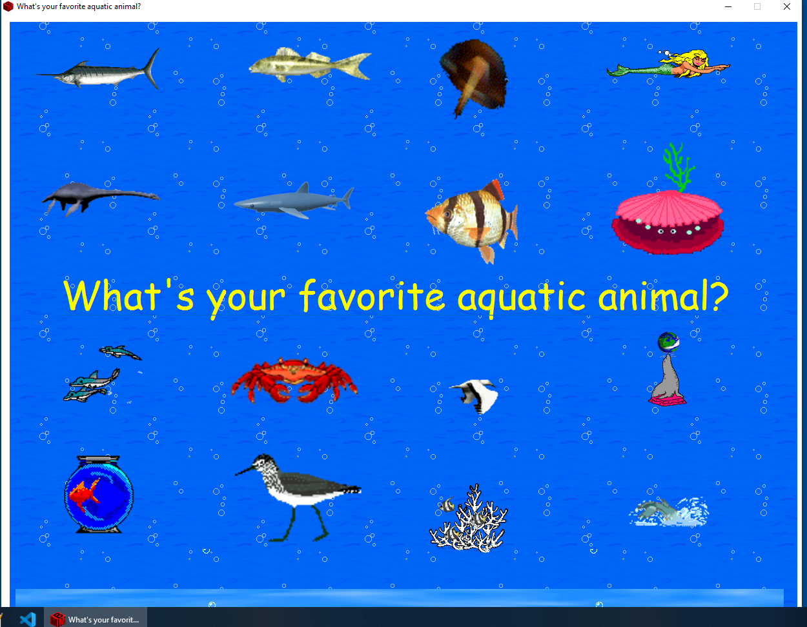
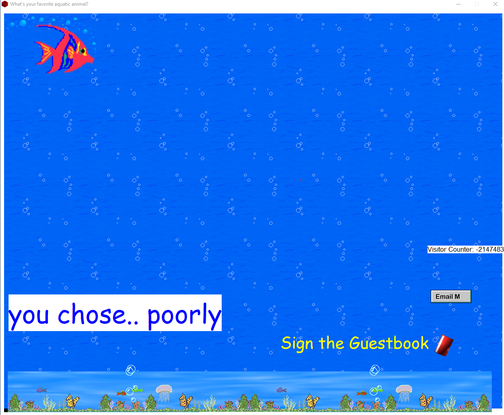
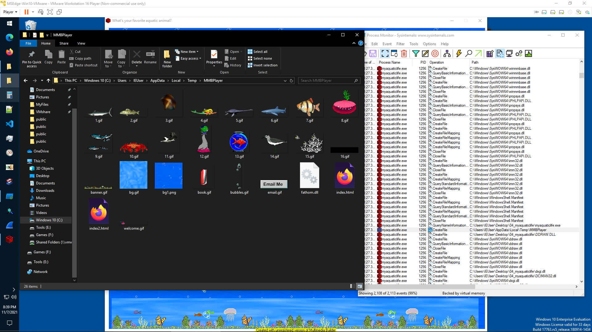
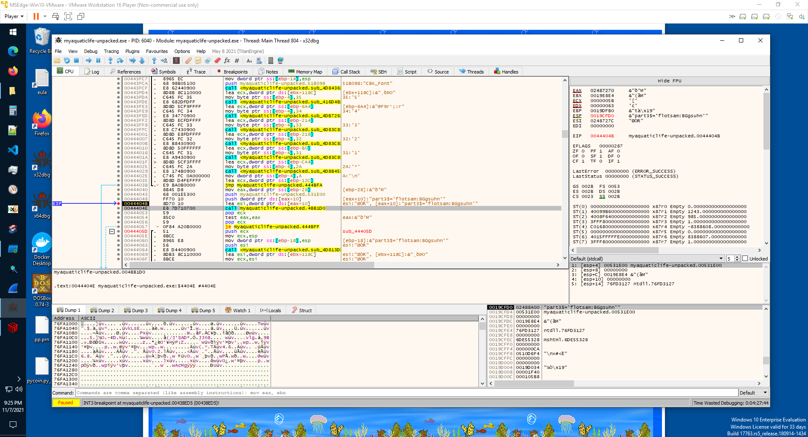
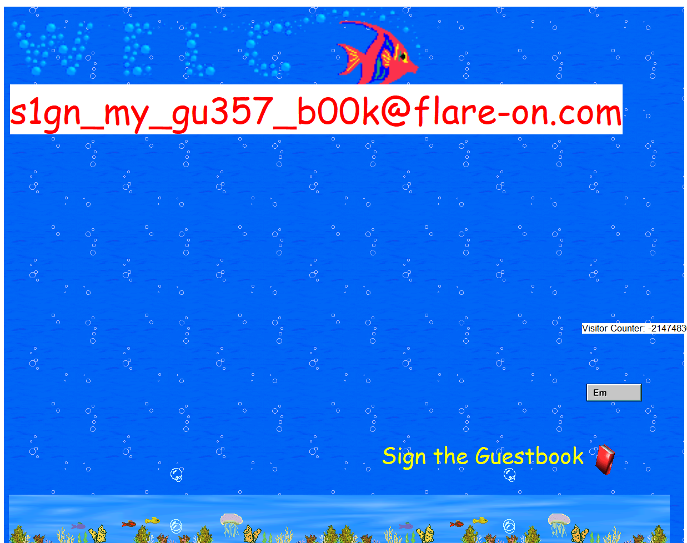

# `Flare-on-8`

[Go back](../README.md)<hr/>

# 04 - myaquaticlife

We are provided with an executable, which was created using Multimedia Builder (MMB).<br>



On the main view are displayed a bunch of aquatic animals, which can be clicked, but nothing seems to do anything. Clicking on the text brings us to another view (yes I had broken the visitor counter in this screenshot)



By using [procmon](https://docs.microsoft.com/en-us/sysinternals/downloads/procmon) we see some temporary files being created at `AppData\Local\Temp\MMBPlayer`, including a `fathom.dll`




From the html files we find out that each button corresponds to a script, and the main view placement is like this
```
1  2  3  4
5  6  7  8
====17====
9  10 11 12
13 14 15 16
```

By reversing `fathom.dll` we find out that each script adds a string to another assigned string.
The names are `derelict, lagan, flotsam and jetsam`

Since the file is packed with UPX we can use CFF Explorer to unpack it and let us save breakpoints after restarts as we analyze dynamically the program.<br>
We find some strings mentioning `script` and `scriptcode`, so we put a breakpoint there and see where it leads us.<br>
As we continue to analyze, we find out that there is an order to the second string (suggested by part1-2-3-4)



So these are the parts
```
Script1
0019CFD0  02685E88  "part1$='derelict:MZZWP'"
Script2
0019CFD0  026864C8  "part2$='lagan:BAJkR'"
Script3
0019CFD0  026859D8  "part2$='flotsam:DFWEyEW'"
Script4
0019CFD0  02696200  "part1$='flotsam:PXopvM'"
Script5
0019CFD0  02685B68  "part2$='derelict:LDNCVYU'"
Script6
0019CFD0  024E4848  "part3$='derelict:yXQsGB'"
Script7
0019CFD0  026861A8  "part2$='jetsam:newaui'"
Script8
0019CFD0  02686338  "part3$='lagan:QICMX'"
Script9
0019CFD0  02686018  "part1$='lagan:rOPFG'"
Script10
0019CFD0  02686658  "part3$='jetsam:HwdwAZ'"
Script11
0019CFD0  02685CF8  "part1$='jetsam:SLdkv'"
Script12
0019CFD0  02692468  "part2$='derelict:LSZvYSFHW'"
Script13
0019CFD0  024B6520  "part3$='flotsam:BGgsuhn'"
Script14
0019CFD0  024940C8  "part4$='lagan:GTYAKlwER'"
Script15
0019CFD0  02685848  "part4$='derelict:RTYXAc'"
Script16
0019CFD0  02696390  "part2$='lagan:GTXI'"
Script17
```
Let's reorder it
```
1-5-6-15
derelict:MZZWPLDNCVYUyXQsGBRTYXAc
1-12-6-15
derelict:MZZWPLSZvYSFHWyXQsGBRTYXAc

9-2-8-14
lagan:rOPFGBAJkRQICMXGTYAKlwER
9-16-8-14
lagan:rOPFGGTXIQICMXGTYAKlwER

4-3-13
flotsam:PXopvMDFWEyEWBGgsuhn

11-7-10
jetsam:SLdkvnewauiHwdwAZ
```
So for each name we have to execute these scripts (some parts are expressed twice with different strings, but let's test the first ones)<br>
These are the combinations
```
1) flotsam (4-3-13)
2) jetsam (11-7-10)
3) lagan (9-2-8-14)
4) derelict (1-5-6-15)
```
Then we click in the middle (Script 17) and we get the flag
```
s1gn_my_gu357_b00k@flare-on.com
```

