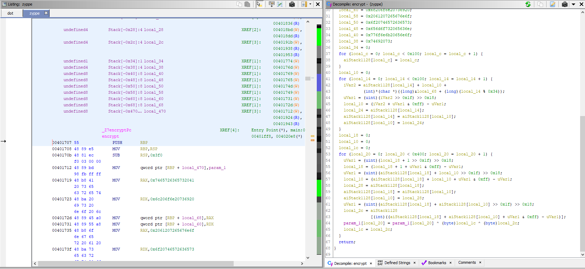

# `Flare-on-8`

[Go back](../README.md)<hr/>

# 05 - FLARE Linux VM

```
Because of your superior performance throughout the FLARE-ON 8 Challenge, the FLARE team has invited you to their office to hand you a special prize! Ooh – a special prize from FLARE ? What could it be? You are led by a strong bald man with a strange sense of humor into a very nice conference room with very thick LED dimming glass. As you overhear him mumbling about a party and its shopping list you notice a sleek surveillance camera. The door locks shut!

Excited, you are now waiting in a conference room with an old and odd looking computer on the table. The door is closed with a digital lock with a full keyboard on it.

Now you realise… The prize was a trap! They love escape rooms and have locked you up in the office to make you test out their latest and greatest escape room technology. The only way out is the door – but it locked and it appears you have to enter a special code to get out. You notice the glyph for U+2691 on it. You turn you attention to the Linux computer - it seems to have been infected by some sort of malware that has encrypted everything in the documents directory, including any potential clues.

Escape the FLARE Linux VM to get the flag - hopefully it will be enough to find your way out.

Hints:
- You can import "FLARE Linux VM.ovf" with both VMWare and VirtualBox.
- Log in as 'root' using the password 'flare'
- If you use VirtualBox and want to use ssh, you may need to enable port forwarding. The following link explains how to do it: https://nsrc.org/workshops/2014/btnog/raw-attachment/wiki/Track2Agenda/ex-virtualbox-portforward-ssh.htm
```

This challenge requires a lot of searching around for clues.<br>
We are provided with a virtual machine, login with user `root` and password `flare`.


We aren't told much. In our user directory we can find some broken files in the `Documents` folder.<br>
Also the bash shell files contain some clues.


By checking the system logs we find some references about a CRON schedule job encrypting the files

```
Aug 26 15:04:17 localhost cron[3445]: (CRON) INFO (Syslog will be used instead of sendmail.)
Aug 26 15:04:17 localhost cron[3445]: (CRON) INFO (RANDOM_DELAY will be scaled with factor 61% if used.)
Aug 26 15:04:17 localhost cron[3445]: (CRON) INFO (running with inotify support)
Aug 26 15:04:46 localhost crontab[3449]: (root) BEGIN EDIT (root)
Aug 26 15:04:48 localhost crontab[3449]: (root) END EDIT (root)
Aug 26 15:05:01 localhost systemd[1]: Started Session 10 of user root.
Aug 26 15:05:01 localhost cron[3452]: pam_unix(crond:session): session opened for user root by (uid=0)
Aug 26 15:05:01 localhost CRON[3453]: (root) CMD (/usr/lib/zyppe)
Aug 26 15:05:01 localhost CRON[3452]: (root) CMDOUT (backberries.txt is now a secret)
Aug 26 15:05:01 localhost CRON[3452]: (root) CMDOUT (banana_chips.txt is now a secret)
Aug 26 15:05:01 localhost CRON[3452]: (root) CMDOUT (blue_cheese.txt is now a secret)
Aug 26 15:05:01 localhost CRON[3452]: (root) CMDOUT (donuts.txt is now a secret)
Aug 26 15:05:01 localhost CRON[3452]: (root) CMDOUT (dumplings.txt is now a secret)
Aug 26 15:05:01 localhost CRON[3452]: (root) CMDOUT (ice_cream.txt is now a secret)
Aug 26 15:05:01 localhost CRON[3452]: (root) CMDOUT (iced_coffee.txt is now a secret)
Aug 26 15:05:01 localhost CRON[3452]: (root) CMDOUT (instant_noodles.txt is now a secret)
Aug 26 15:05:01 localhost CRON[3452]: (root) CMDOUT (nachos.txt is now a secret)
Aug 26 15:05:01 localhost CRON[3452]: (root) CMDOUT (natillas.txt is now a secret)
Aug 26 15:05:01 localhost CRON[3452]: (root) CMDOUT (nutella.txt is now a secret)
Aug 26 15:05:01 localhost CRON[3452]: (root) CMDOUT (oats.txt is now a secret)
Aug 26 15:05:01 localhost CRON[3452]: (root) CMDOUT (omelettes.txt is now a secret)
Aug 26 15:05:01 localhost CRON[3452]: (root) CMDOUT (oranges.txt is now a secret)
Aug 26 15:05:01 localhost CRON[3452]: (root) CMDOUT (raisins.txt is now a secret)
Aug 26 15:05:01 localhost CRON[3452]: (root) CMDOUT (rasberries.txt is now a secret)
Aug 26 15:05:01 localhost CRON[3452]: (root) CMDOUT (reeses.txt is now a secret)
Aug 26 15:05:01 localhost CRON[3452]: (root) CMDOUT (sausages.txt is now a secret)
Aug 26 15:05:01 localhost CRON[3452]: (root) CMDOUT (shopping_list.txt is now a secret)
Aug 26 15:05:01 localhost CRON[3452]: (root) CMDOUT (spaghetti.txt is now a secret)
Aug 26 15:05:01 localhost CRON[3452]: (root) CMDOUT (strawberries.txt is now a secret)
Aug 26 15:05:01 localhost CRON[3452]: (root) CMDOUT (tacos.txt is now a secret)
Aug 26 15:05:01 localhost CRON[3452]: (root) CMDOUT (tiramisu.txt is now a secret)
Aug 26 15:05:01 localhost CRON[3452]: (root) CMDOUT (tomatoes.txt is now a secret)
Aug 26 15:05:01 localhost CRON[3452]: (root) CMDOUT (udon_noddles.txt is now a secret)
Aug 26 15:05:01 localhost CRON[3452]: (root) CMDOUT (ugali.txt is now a secret)
Aug 26 15:05:01 localhost CRON[3452]: (root) CMDOUT (unagi.txt is now a secret)
Aug 26 15:05:01 localhost CRON[3452]: (root) CMDOUT (.daiquiris.txt is now a secret)
Aug 26 15:05:01 localhost CRON[3452]: pam_unix(crond:session): session closed for user root

Aug 26 17:22:01 localhost CRON[4144]: (root) CMD (/usr/lib/zyppe)
Aug 26 17:22:01 localhost CRON[4143]: (root) CMDOUT (tacos.txt is now a secret)
Aug 26 17:22:01 localhost CRON[4143]: (root) CMDOUT (tiramisu.txt is now a secret)
Aug 26 17:22:01 localhost CRON[4143]: (root) CMDOUT (tomatoes.txt is now a secret)
Aug 26 17:22:01 localhost CRON[4143]: pam_unix(crond:session): session closed for user root

Aug 26 17:37:01 localhost CRON[4479]: (root) CMD (/usr/lib/zyppe)
Aug 26 17:37:01 localhost CRON[4478]: (root) CMDOUT (tacos.txt is now a secret)
Aug 26 17:37:01 localhost CRON[4478]: (root) CMDOUT (tiramisu.txt is now a secret)
Aug 26 17:37:01 localhost CRON[4478]: (root) CMDOUT (tomatoes.txt is now a secret)
Aug 26 17:37:01 localhost CRON[4478]: pam_unix(crond:session): session closed for user root
```

We reverse `zyppe` and we figure out the encryption is symmetric, to get the files back you just remove the `.broken` and the cron job will run again on the files and decrypt them.



The resultant files are a bunch of puzzles...<br>
Here are all the solutions

```
./backberries.txt
Decode text ISO-8859-14 Latin 8 Celtic (28604)
XOR Reese's
If you arE not good in mathS, thE only thing toat can savE you is to be a baSh Expert. OtherwiSE you will bE lockEd oere forever HA HA HA!

./banana_chips.txt
Decode text ISO-8859-14 Latin 8 Celtic (28604)
XOR Reese's
ArE you good at mathS? We lovE maths at FLARE! We use this formula a lot to decodE bytES: "ENCODEDXBYTE + 27 + NUMBER1 * NUMBEr2 - NUMBER3"

./blue_cheese.txt
Decode text ISO-8859-14 Latin 8 Celtic (28604)
XOR Reese's
ToE 4th bytE of thE password is: 0x35

./daiquiris.txt
Bifid cipher decode (keyword eggs from hints below)
The 7th byte of the password is: 0x66

./donuts.txt
Did you know that Giovan Battista Bellaso loved microwaves?

./dumplings.txt
Are you missing something? You should search for it better! It's hidden, but not really.

./ice_cream.txt
ASCII Shift +4 / ROT47 -4
If this challenge is too difficult and you want to give up or just in case you got hungry, what about baking some muffins? Try this recipe:
0 - Cinnamon
1 - Butter 150gr
2 - Lemon 1/2
3 - Eggs 3
4 - Sugar 150gr
5 - Flour 250gr
6 - Milk 30gr
7 - Icing sugar 10gr
8 - Apple 100gr
9 - Raspberries 100gr

Mix 0 to 9 and bake for 30 minutes at 180C.

./iced_coffee.txt
The only problem with RC4 is that you need a key. The FLARE team normally uses this number: "SREFBE" (as an UTF-8 string). If you have no idea what that means, you should give up and bake some muffins.
The~only~problem~with~RC4~is~that~you~need~a~key.~The~FLARE~team~normally~uses~this~number:~"SREFBE"~(as~an~UTF-8~string).~If~you~have~no~idea~what~that~means,~you~should~give~up~and~bake~some~muffins.

./instant_noodles.txt
The 5th byte of the password is: 0xMS
The~5th~byte~of~the~password~is:~0xMS.

./nachos.txt
RC4 493513 (which is SREFBE initials from muffin recipe...)
In the FLARE team we really like Felix Delastelle algorithms, specially the one which combines the Polybius square with transposition, and uses fractioiation to achieve diffusion.

./natillas.txt
Do you know n.tillas? In Spain, this term refers to a custard dish made with milk and KEYWORD, simil.r to other European creams as crème anglaise. In Colombia, the delicacy does not include KEYWORD, and is called natilla.

./nutella.txt
The 6th byte of the password is: 0x36

./oats.txt
Vigenere (MICROWAVES)
You should follow the FLARE team in Twitter. They post a bunch of interesting stuff and have great conversation on Twitter!
https://twitter.com/anamma_06
https://twitter.com/MalwareMechanic

./omelettes.txt
Vigenere (MICROWAVES)
You should follow the FLARE team in Twitter. Otherwise they may get angry and not let you leave even if you get the flag.
https://twitter.com/anamma_06
https://twitter.com/osardar1
https://twitter.com/MalwareMechanic

./oranges.txt
Vigenere (MICROWAVES)
The 8th byte of the password is: 0x60

./raisins.txt=
Base64
The 3rd byte of the password is.. it is a joke, we don't like raisins!

./rasberries.txt=
Base64
The 3rd byte of the password is: 0x51

./reeses.txt
Base64
We LOVE "Reese's", they are great for everything! They are amazing in ice-cream and they even work as a key for XOR encoding.

./sausages.txt
Rotate left 1
Th.e 2.st b.yt.e .of th.e p.a.s.s.w.ord .i.s 0x.34

./shopping_list.txt
/
[U]don noodles
[S]trawberries
[R]eese's
/
[B]anana chips
[I]ce Cream
[N]atillas
/
[D]onuts
[O]melettes
[T]acos


./spaghetti.txt
Rotate left 1
.In th.e FL.AR.E l.an.g.u.a.g.e ".sp.a.gh.ett.i" .i.s ".c.3BhZ2hldHRp".
(Hint to Base64)

./strawberries.txt
Rotate left 1
.In th.e FL.AR.E t.e.a.m .w.e l.i.k.e t.o .sp.e.a.k .in .c.od.e. .Y.o.u .sh.o.uld l.e.arn .o.ur l.an.g.u.a.g.e, .oth.er.w.i.s.e .y.o.u .w.ant b.e .abl.e t.o .sp.e.a.k .w.ith .u.s .wh.en .y.o.u .e.s.c.ap.e (.if .y.o.u .m.an.a.g.e t.o .e.s.c.ap.e.!.). F.or .ex.a.mpl.e, .in.st.e.ad .of ".str.a.wb.err.i.e.s" .w.e .s.a.y ".c.3R.y.YXd.iZXJ.y.a.WVz".
(Hint to Base64)

./tacos.txt
https://twitter.com/anamma_06/status/1414583864865996803
AES Decrypt
Key: Sheep should sleep in a shed15.2 (UTF-8)
IV: PIZZA00000000000 (UTF-8)
CBC Hex -> Raw
Woow! It seems you are very very close to get the flag! Be careful when converting decimal and hexadecimal values to ASCII and hurry up before we run out of tacos!

./tiramisu.txt
The 9th byte of the password is the atomic number of the element moscovium
The 10th byte of the password is the bell number preceding 203
The 12th byte of the password is the largest known number to be the sum of two primes in exactly two different ways
The 14th (and last byte) of the password is the sum of the number of participants from Spain, Singapore and Indonesia that finished the FLARE-ON 7, FLARE-ON 6 or FLARE-ON 5

./tomatoes.txt
It seems you are close to escape... We are preparing the tomatoes to throw at you when you open the door! It is only a joke...
The 11th byte of the password is the number of unique words in /etc/Quijote.txt
The 13th byte of the password is revealed by the FLARE alias

./udon_noddles.txt
"ugali", "unagi" and "udon noodles" are delicious. What a coincidence that all of them start by "u"!

./ugali.txt
Ugali with Sausages or Spaghetti is tasty. It doesn’t matter if you rotate it left or right, it is still tasty! You should try to come up with a great recipe using CyberChef.

./unagi.txt
The 1st byte of the password is 0x45
```

Summary
```
The 1st byte of the password is 0x45
Th.e 2.st b.yt.e .of th.e p.a.s.s.w.ord .i.s 0x.34
The 3rd byte of the password is: 0x51
The 4th byte of the password is: 0x35
The 5th byte of the password is: 0xMS
The 6th byte of the password is: 0x36
The 7th byte of the password is: 0x66
The 8th byte of the password is: 0x60
The 9th byte of the password is the atomic number of the element moscovium
The 10th byte of the password is the bell number preceding 203
The 11th byte of the password is the number of unique words in /etc/Quijote.txt
The 12th byte of the password is the largest known number to be the sum of two primes in exactly two different ways
The 13th byte of the password is 0x35
The 14th (and last byte) of the password is the sum of the number of participants from Spain, Singapore and Indonesia that finished the FLARE-ON 7, FLARE-ON 6 or FLARE-ON 5
```
(0xMS is decoded with the muffin recipe, using the initials...)<br>
Resultant password is ```E4Q5d6f`s4lD5I```<br>
Now let's run `dot` again and...
```
Password (ASCII):E4Q5d6f`s4lD5I
Correct password!
Flag: H4Ck3r_e5c4P3D@flare-on.com
```

