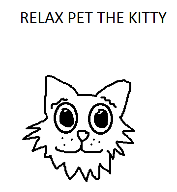

# `Flare-on-8`

[Go back](../README.md)

# 06 - PetTheKitty
PCAPNG file, consists mainly of TCP messages. 
Steps: 
- from tcp stream 0 extract PNG from beginning of PNG header to end of packet (including after IEND !!!) 

- patch the PNG with the next packet message, which is a PA30 patch file type ([use delta_patch.py from github](https://gist.github.com/wumb0/9542469e3915953f7ae02d63998d2553)) 
- create a TCP server listening on port 1337, set host file to redirect the domain name to the server ip (eg. `127.0.0.1 xn--zn8hrcq4eeadihijjk.flare-on.com`) 
[Swiddler](https://github.com/jlucansky/Swiddler) seems to be the ideal candidate, with it you can also send packets as bytes
and export to pcap very easily. 
- Run the Le_Meow exported function from the extracted EXE/DLL file, obtained from patching the PNG ("RELAX PET THE KITTY" bitmap should appear) 

- In Swiddler, send the tcp stream 1 packets (just the client packets should be enough) 
- Put a breakpoint in the commands execution... the `type Gotcha.txt` result contains the flag 
`1m_H3rE_Liv3_1m_n0t_a_C4t@flare-on.com`