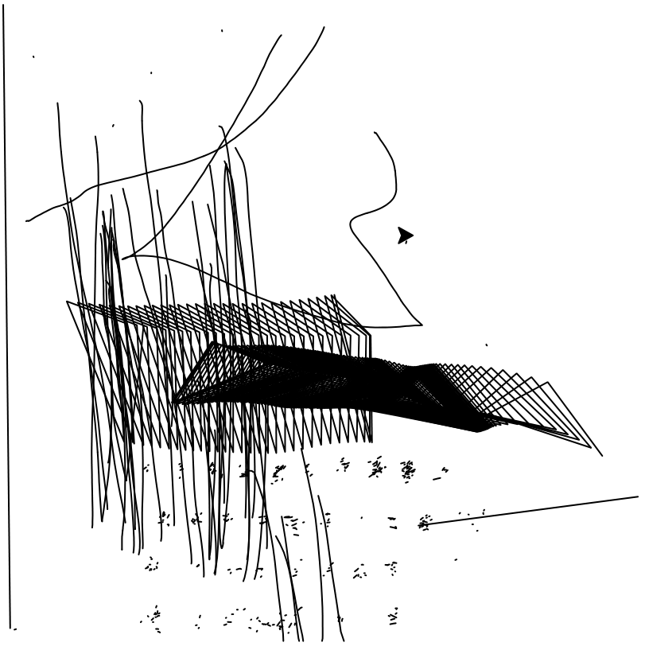

# `Hack.lu - 2021`
[Go back](../README.md)<hr/>
# Touchy Logger


In this challenge we are provided with a `touch.log` file, which consists of input events captured by `libinput debug-events`.<br>
In particular, we are presented with touch events made by a drawing tablet

```
[touch.log]
-event2   DEVICE_ADDED     Power Button                      seat0 default group1  cap:k
-event19  DEVICE_ADDED     Video Bus                         seat0 default group2  cap:k
-event1   DEVICE_ADDED     Lid Switch                        seat0 default group3  cap:S
-event0   DEVICE_ADDED     Sleep Button                      seat0 default group4  cap:k
-event17  DEVICE_ADDED     Integrated RGB Camera: Integrat   seat0 default group5  cap:k
-event18  DEVICE_ADDED     Integrated RGB Camera: Integrat   seat0 default group5  cap:k
-event5   DEVICE_ADDED     Wacom HID 525C Finger             seat0 default group6  cap:t  size 259x173mm ntouches 10 calib
-event4   DEVICE_ADDED     Wacom HID 525C Pen                seat0 default group6  cap:T  size 259x173mm calib
-event15  DEVICE_ADDED     Intel HID events                  seat0 default group7  cap:k
-event3   DEVICE_ADDED     AT Translated Set 2 keyboard      seat0 default group8  cap:k
-event16  DEVICE_ADDED     ThinkPad Extra Buttons            seat0 default group9  cap:kS
 event16  SWITCH_TOGGLE    +0.000s	switch tablet-mode state 1
-event5   TOUCH_DOWN       +0.000s	0 (0)  1.10/97.95 ( 2.85/169.28mm)
 event5   TOUCH_FRAME      +0.000s	
 event5   TOUCH_UP         +0.044s	0 (0)
 event5   TOUCH_FRAME      +0.044s	
 event5   TOUCH_DOWN       +1.260s	0 (0) 50.12/99.97 (129.93/172.78mm)
 event5   TOUCH_FRAME      +1.260s	
 event5   TOUCH_MOTION     +1.268s	0 (0) 50.20/99.57 (130.12/172.07mm)
 [...]
```

By parsing the events and drawing them with only the coordinates brings us the following picture:



We notice a lot of dots in the bottom of the image, so we can figure out that those touches were made on an on-screen keyboard.
We then take into account the "slot" number (for multi touch tracking) and get the revised image

```
+1.268s	0 (0) 50.20/99.57
--------^^^^^------------
slot and seat_slot numbers
```


We can then begin to clean the log and focus our view on what is relevant


After cleaning the log, finding the flag is a matter of replaying said touches on an on-screen keyboard...
unfortunately I ran out of time and couldn't get a proper result with different keyboard styles.<br>
At the end of the CTF it was revealed that the correct keyboard was the Ubuntu GNOME on-screen keyboard.
<br><hr/>
Here are the python scripts which I made to parse, draw and replay the actions, using the turtle and pyautogui libraries<br>
[Main script](drawreplaytouchy.py)<br>
[Parser](mytouchylib.py)
