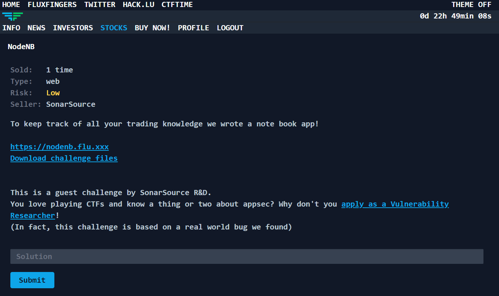
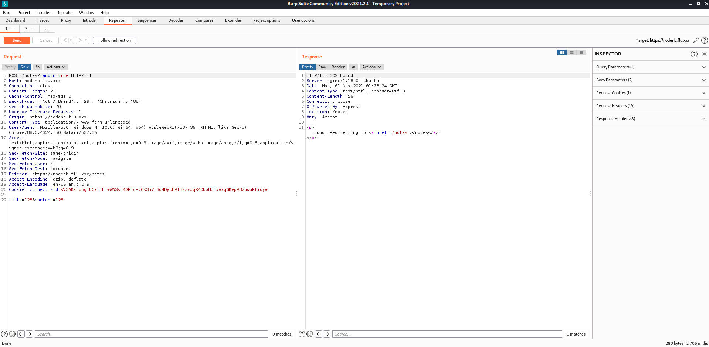
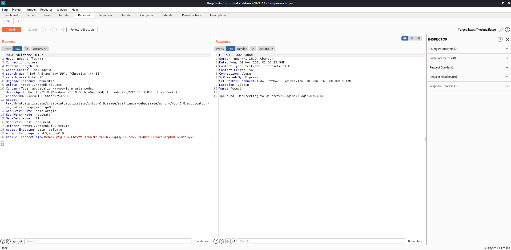
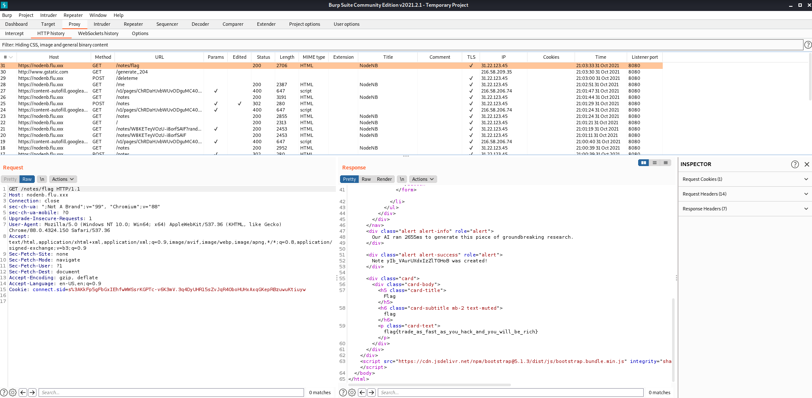
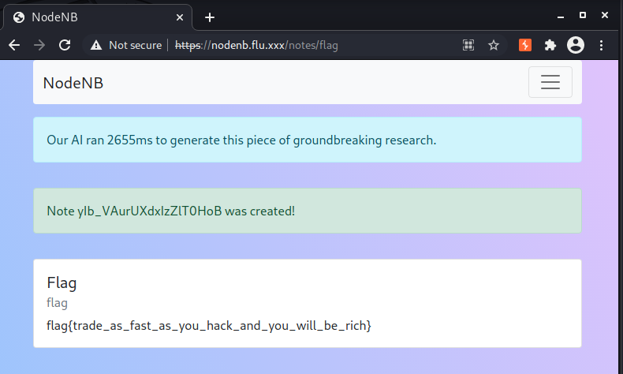

# `Hack.lu - 2021`
[Go back](../README.md)<hr/>
# NodeNB



The challenge provides us with a note book app website and its source, which is possible to run with docker.<br>
(In my case running the sample docker container required editing the Dockerfile due to file permission issues, [here is the revised Dockerfile](Dockerfile-fix.dockerfile))

We notice the .env file contains a variable named FLAG, which will supposedly contain the flag in the actual website.

The app allows you to register, login, logout, save notes or delete your account.

By studying db.js we notice that the flag is taken from the process environment variable and written in the content of the note with nid (note id) `flag`
```js
[db.js]
const FLAG = process.env.FLAG ?? 'fakeflag{dummy}';
[...]
db.hmset('note:flag', {
    'title': 'Flag',
    'content': FLAG,
});
```

Accessing a note is a simple `GET /notes/:nid` request.
```js
[server.js]
app.get('/notes/:nid', ensureAuth, async (req, res) => {
    const { nid } = req.params;
    if (!await db.hasUserNoteAcess(req.session.user.id, nid)) {
        return res.redirect('/notes');
    }
    const note = await db.getNote(nid);
    res.render('note', { note });
});
```
`db.js` reveals us that notes can be viewed not only by the user who saved it, but also by whichever user has no password hash in the database (a comment suggests us that `// system user has no password`)

```js
[db.js]
async hasUserNoteAcess(uid, nid) {
    if (await db.sismember(`uid:${uid}:notes`, nid)) {
        return true;
    }
    if (!await db.hexists(`uid:${uid}`, 'hash')) {
        // system user has no password
        return true;
    }
    return false;
},
```

At this point I figured out I needed to either login as system or be able to delete my password from the database.
Unfortunately I was unable to finish the challenge but this is how to complete it:<br>
When creating a note, by sending any value in the parameter `random` (eg. `POST /notes&random=1`), the request is stalled for some time, and by quickly deleting our account, a race condition occurs.
```js
[server.js]
app.post('/notes', ensureAuth, async (req, res) => {
    let { title, content } = req.body;
    if (req.query.random) {
        const ms = Math.floor(2000 + Math.random() * 1000);
        await new Promise(r => setTimeout(r, ms));
        res.flash('info', `Our AI ran ${ms}ms to generate this piece of groundbreaking research.`);
        content = 'Lorem ipsum dolor sit amet, consetetur sadipscing elitr, sed diam nonumy eirmod tempor invidunt ut labore et dolore magna aliquyam erat, sed diam voluptua. At vero eos et accusam et justo duo dolores et ea rebum. Stet clita kasd gubergren, no sea takimata sanctus est Lorem ipsum dolor sit amet.';
    }

    if (!title || !content || typeof title !== 'string' || typeof content !== 'string') {
        res.flash('danger', 'invalid title or content');
        return res.status(400).render('notes');
    }

    const nid = await db.createNote(title, content);
    await db.addNoteToUser(req.session.user.id, nid);

    res.flash('success', `Note ${nid} was created!`);
    res.redirect('/notes');
});

[...]

app.post('/deleteme', ensureAuth, async (req, res) => {
    await db.deleteUser(req.session.user.id);
    req.session.destroy(async (error) => {
        if (error) {
            console.error('deleteme error:', error?.message);
        }
        res.clearCookie('connect.sid');
        res.redirect('/login');
    });
});
```





Now, when requesting `GET /notes/flag` with our previous cookie, we are able to view the note and get the flag

