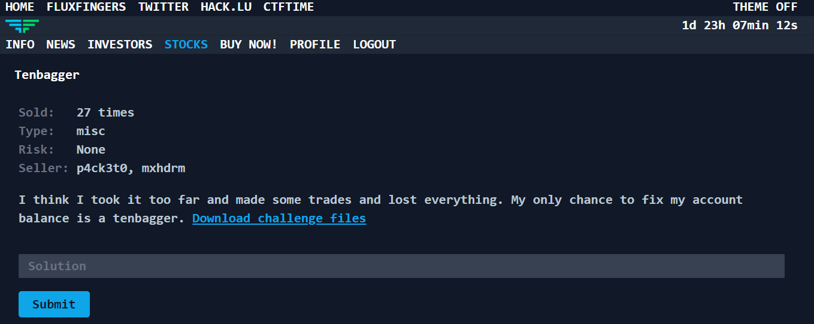
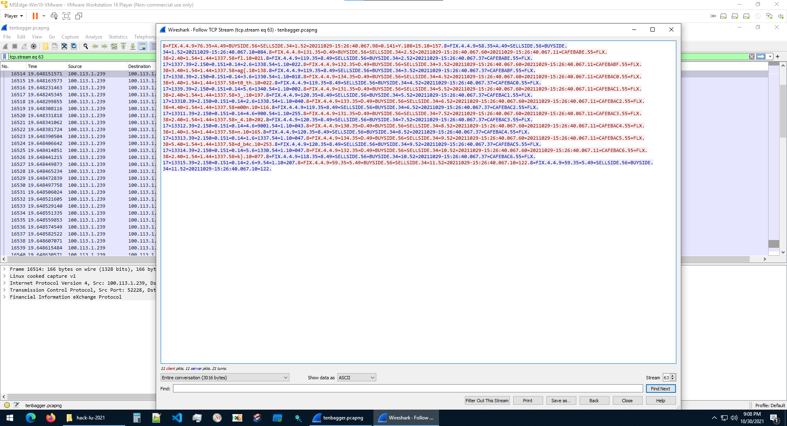
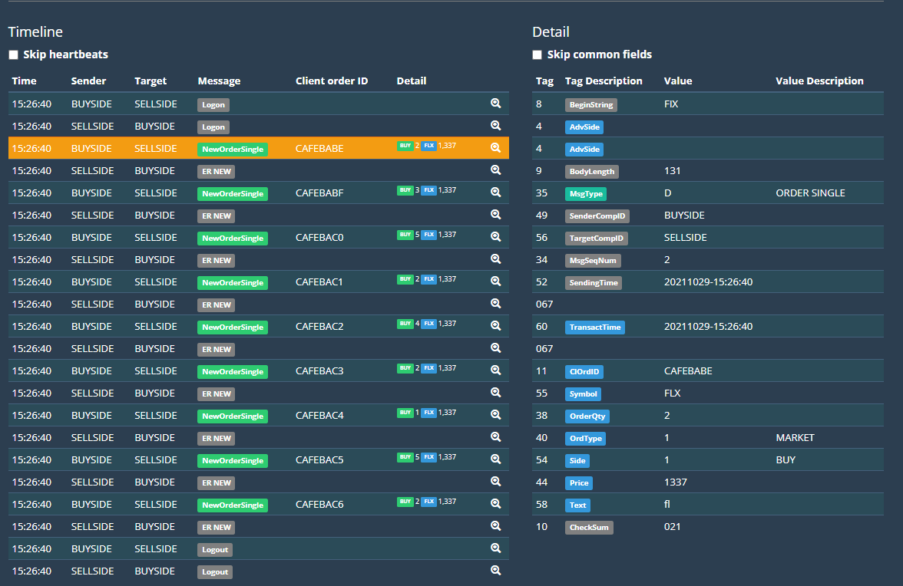
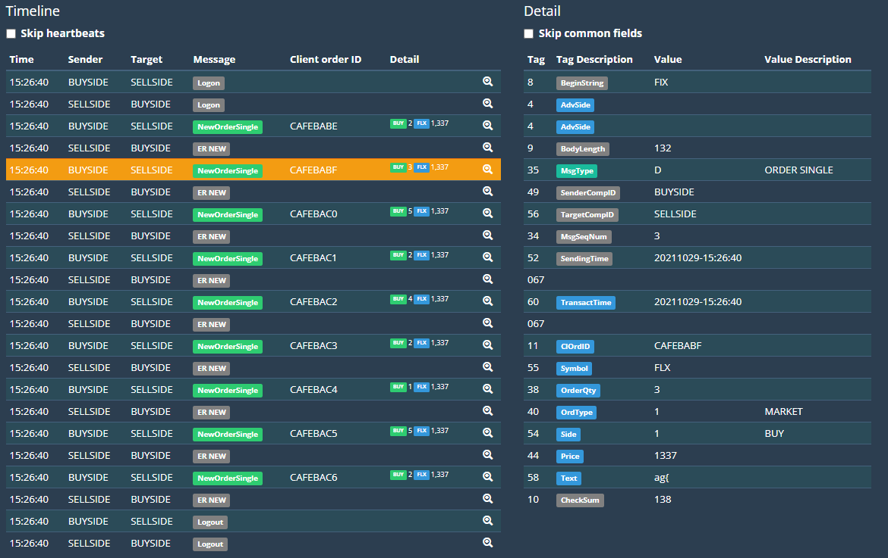

# `Hack.lu - 2021`
[Go back](../README.md)<hr/>
# Tenbagger



We have a PCAPNG file to analyze.
After thoroughly analyzing the file (or searching for significant keywords like buy/sell) we find a relevant TCP scream, seemingly involving buy and sell messages.



```
8=FIX.4.4.9=76.35=A.49=BUYSIDE.56=SELLSIDE.34=1.52=20211029-15:26:40.067.98=0.141=Y.108=15.10=157.8=FIX.4.4.9=58.35=A.49=SELLSIDE.56=BUYSIDE.34=1.52=20211029-15:26:40.067.10=084.8=FIX.4.4.9=131.35=D.49=BUYSIDE.56=SELLSIDE.34=2.52=20211029-15:26:40.067.60=20211029-15:26:40.067.11=CAFEBABE.55=FLX.38=2.40=1.54=1.44=1337.58=fl.10=021.8=FIX.4.4.9=119.35=8.49=SELLSIDE.56=BUYSIDE.34=2.52=20211029-15:26:40.067.37=CAFEBABE.55=FLX.17=1337.39=2.150=0.151=0.14=2.6=1338.54=1.10=022.8=FIX.4.4.9=132.35=D.49=BUYSIDE.56=SELLSIDE.34=3.52=20211029-15:26:40.067.60=20211029-15:26:40.067.11=CAFEBABF.55=FLX.38=3.40=1.54=1.44=1337.58=ag{.10=138.8=FIX.4.4.9=119.35=8.49=SELLSIDE.56=BUYSIDE.34=3.52=20211029-15:26:40.067.37=CAFEBABF.55=FLX.17=1338.39=2.150=0.151=0.14=3.6=1330.54=1.10=018.8=FIX.4.4.9=134.35=D.49=BUYSIDE.56=SELLSIDE.34=4.52=20211029-15:26:40.067.60=20211029-15:26:40.067.11=CAFEBAC0.55=FLX.38=5.40=1.54=1.44=1337.58=t0_th.10=022.8=FIX.4.4.9=119.35=8.49=SELLSIDE.56=BUYSIDE.34=4.52=20211029-15:26:40.067.37=CAFEBAC0.55=FLX.17=1339.39=2.150=0.151=0.14=5.6=1340.54=1.10=002.8=FIX.4.4.9=131.35=D.49=BUYSIDE.56=SELLSIDE.34=5.52=20211029-15:26:40.067.60=20211029-15:26:40.067.11=CAFEBAC1.55=FLX.38=2.40=1.54=1.44=1337.58=3_.10=197.8=FIX.4.4.9=120.35=8.49=SELLSIDE.56=BUYSIDE.34=5.52=20211029-15:26:40.067.37=CAFEBAC1.55=FLX.17=13310.39=2.150=0.151=0.14=2.6=1338.54=1.10=040.8=FIX.4.4.9=133.35=D.49=BUYSIDE.56=SELLSIDE.34=6.52=20211029-15:26:40.067.60=20211029-15:26:40.067.11=CAFEBAC2.55=FLX.38=4.40=1.54=1.44=1337.58=m00n.10=116.8=FIX.4.4.9=119.35=8.49=SELLSIDE.56=BUYSIDE.34=6.52=20211029-15:26:40.067.37=CAFEBAC2.55=FLX.17=13311.39=2.150=0.151=0.14=4.6=900.54=1.10=255.8=FIX.4.4.9=131.35=D.49=BUYSIDE.56=SELLSIDE.34=7.52=20211029-15:26:40.067.60=20211029-15:26:40.067.11=CAFEBAC3.55=FLX.38=2.40=1.54=1.44=1337.58=_4.10=202.8=FIX.4.4.9=120.35=8.49=SELLSIDE.56=BUYSIDE.34=7.52=20211029-15:26:40.067.37=CAFEBAC3.55=FLX.17=13312.39=2.150=0.151=0.14=4.6=9001.54=1.10=043.8=FIX.4.4.9=130.35=D.49=BUYSIDE.56=SELLSIDE.34=8.52=20211029-15:26:40.067.60=20211029-15:26:40.067.11=CAFEBAC4.55=FLX.38=1.40=1.54=1.44=1337.58=n.10=165.8=FIX.4.4.9=120.35=8.49=SELLSIDE.56=BUYSIDE.34=8.52=20211029-15:26:40.067.37=CAFEBAC4.55=FLX.17=13313.39=2.150=0.151=0.14=1.6=1337.54=1.10=047.8=FIX.4.4.9=134.35=D.49=BUYSIDE.56=SELLSIDE.34=9.52=20211029-15:26:40.067.60=20211029-15:26:40.067.11=CAFEBAC5.55=FLX.38=5.40=1.54=1.44=1337.58=d_b4c.10=253.8=FIX.4.4.9=120.35=8.49=SELLSIDE.56=BUYSIDE.34=9.52=20211029-15:26:40.067.37=CAFEBAC5.55=FLX.17=13314.39=2.150=0.151=0.14=5.6=1330.54=1.10=047.8=FIX.4.4.9=132.35=D.49=BUYSIDE.56=SELLSIDE.34=10.52=20211029-15:26:40.067.60=20211029-15:26:40.067.11=CAFEBAC6.55=FLX.38=2.40=1.54=1.44=1337.58=k}.10=077.8=FIX.4.4.9=118.35=8.49=SELLSIDE.56=BUYSIDE.34=10.52=20211029-15:26:40.067.37=CAFEBAC6.55=FLX.17=13315.39=2.150=0.151=0.14=2.6=9.54=1.10=207.8=FIX.4.4.9=59.35=5.49=BUYSIDE.56=SELLSIDE.34=11.52=20211029-15:26:40.067.10=122.8=FIX.4.4.9=59.35=5.49=SELLSIDE.56=BUYSIDE.34=11.52=20211029-15:26:40.067.10=122.
```

Researching the signature reveals that this stream follows the FIX protocol.

The messages contain text after the `1337.58=` tag.<br>
Combining the text gives us the flag:<br>
`flag{t0_th3_m00n_4nd_b4ck}]`

(A FIX protocol parser can be used to view the messages in a more clear way eg. https://fixparser.targetcompid.com/)


