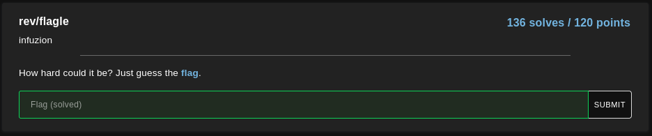
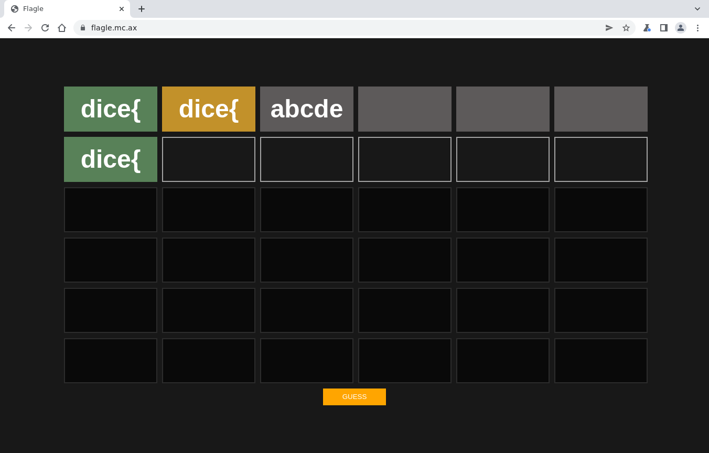
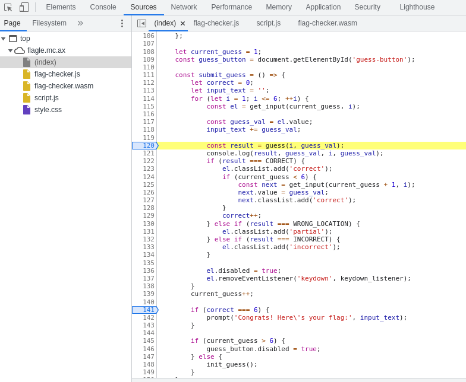
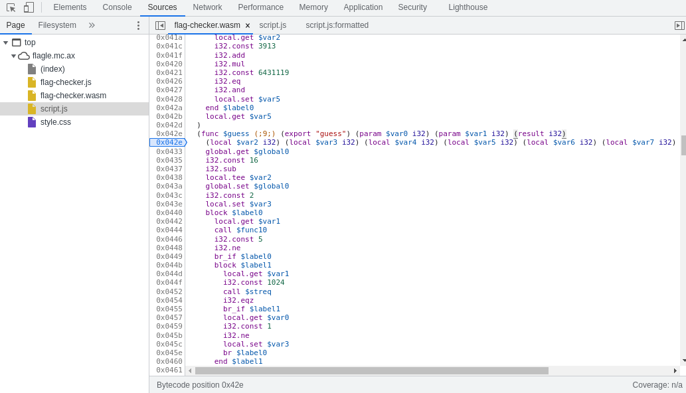
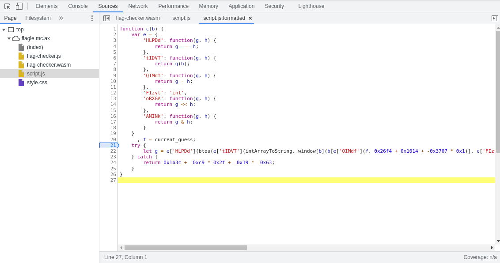
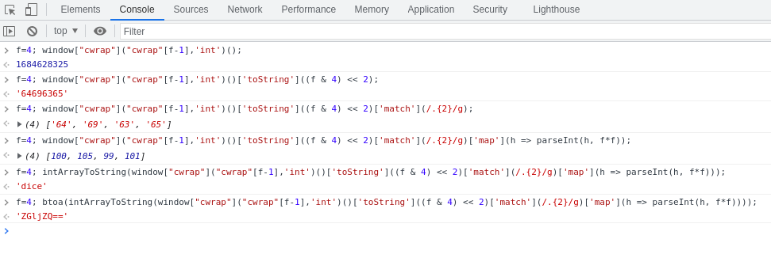
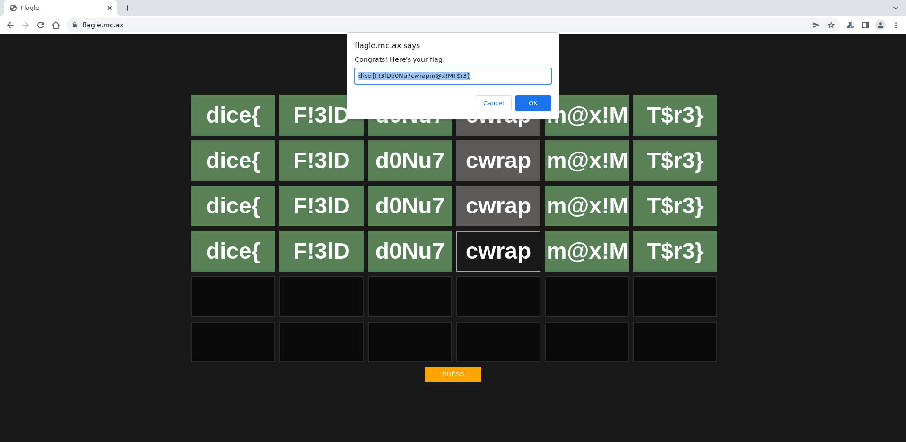

# `DiceCTF 2022`
[Go back](../README.md)<hr/>
# flagle



In this challenge we are faced with a game where you have to guess 6 words of 5 characters each. <br>
When a word is correct and in the correct place it is marked as green. <br>
When a word is correct but in the wrong place it is marked as yellow. <br>
When a word is wrong it is marked as gray.



By inspecting the page we can find the game source code. <br>
The actual verification functions are split in two files: one is in WebAssembly and the other is an "obfuscated" Javascript file.







We can proceed to save the files and analyse them. <br>
To be able to view WebAssembly in a more C looking code we can use the [WebAssembly Binary Toolkit](https://github.com/WebAssembly/wabt)

```
wasm-decompile flag-checker.wasm > flag-checker-wasm-dec
```

We can now proceed to "guess" the flag!

## Premise

The parts 1, 2, 3, 5 and 6 of the flag are in the `flag-checker.wasm` file, while part n. 4 is in `Script.js`.

In the WebAssembly file the validation occurs in the `guess` function, though it seems like the various parts of the flag validation could be found separately in other `validation_n` functions (where with `n` I refer to the part number) which I believe were inline.

## Part n.1

The first part of the string is pretty easy to guess. Knowing the signature of the flag we can try to insert "dice{" and it will work.

Looking into the code we can see that it's a simple string comparison

```cpp
data d_a(offset: 1024) = "dice{\00";

export function streq(a:ubyte_ptr, b:ubyte_ptr):int {
  var c:int;
  return loop L_a {
           c = a[0];
           if (c) goto B_b;
           if (b[0]) goto B_b;
           return 1;
           label B_b:
           if (c == b[0]) goto B_c;
           return 0;
           label B_c:
           b = b + 1;
           a = a + 1;
           continue L_a;
         }
}

export function validate_1(a:int):int {
  return streq(a, 1024)
}
```

So, part n.1 is `dice{`

## Part n.2

Validation for the second part of the flag consists in checking the ascii decimal values of the 5 characters (indicated as a, b, c, d, e in the function parameters). The problem is that the values are scrambled around before being checked

```cpp
function validate(a:int, b:int, c:int, d:int, e:int):int {
  var f:int = g_a - 16;
  f[15]:byte = a;
  f[14]:byte = b;
  f[13]:byte = c;
  f[12]:byte = d;
  d = f[14]:ubyte;
  f[14]:byte = f[13]:ubyte;
  f[13]:byte = d;
  d = f[13]:ubyte;
  f[13]:byte = f[12]:ubyte;
  f[12]:byte = d;
  d = f[13]:ubyte;
  f[13]:byte = f[15]:ubyte;
  f[15]:byte = d;
  d = f[13]:ubyte;
  f[13]:byte = f[12]:ubyte;
  f[12]:byte = d;
  d = f[15]:ubyte;
  f[15]:byte = f[14]:ubyte;
  f[14]:byte = d;
  d = 0;
  if (f[15]:ubyte != 51) goto B_a;
  if (f[14]:ubyte != 108) goto B_a;
  if (f[13]:ubyte != 33) goto B_a;
  d = e == 68 & f[12]:ubyte == 70;
  label B_a:
  return d;
}
```

We can either manually figure it out or just make a simple python script to tell us where the actual characters end up

```py
a = "a"
b = "b"
c = "c"
d = "d"
e = "e"

t5 = a  # f[15]:byte = a;
t4 = b  # f[14]:byte = b;
t3 = c  # f[13]:byte = c;
t2 = d  # f[12]:byte = d;
d = t4  # d = f[14]:ubyte;
t4 = t3 # f[14]:byte = f[13]:ubyte;
t3 = d  # f[13]:byte = d;
d = t3  # d = f[13]:ubyte;
t3 = t2 # f[13]:byte = f[12]:ubyte;
t2 = d  # f[12]:byte = d;
d = t3  # d = f[13]:ubyte;
t3 = t5 # f[13]:byte = f[15]:ubyte;
t5 = d  # f[15]:byte = d;
d = t3  # d = f[13]:ubyte;
t3 = t2 # f[13]:byte = f[12]:ubyte;
t2 = d  # f[12]:byte = d;
d = t5  # d = f[15]:ubyte;
t5 = t4 # f[15]:byte = f[14]:ubyte;
t4 = d  # f[14]:byte = d;
print(f"{t5} {t4} {t3} {t2}")
```
Prints `c d b a` <br>
So f[15] is c, f[14] is d, f[13] is b, f[12] is a
```cpp
if (f[15]:ubyte != 51) goto B_a;
if (f[14]:ubyte != 108) goto B_a;
if (f[13]:ubyte != 33) goto B_a;
d = e == 68 & f[12]:ubyte == 70;
```
So these are our values
```
a = 70, b = 33, c = 51, d = 108, e = 68
```

Converting to characters we find out part n.2 is `F!3lD`

## Part n.3

Like the previous part, the validation is taking the string characters as decimals and making a bunch of checks

```cpp
export function validate_3(a:int, b:int, c:int, d:int, e:int):int {
  var f:int = 0;
  if (b * a != 4800) goto B_a;
  if (c + a != 178) goto B_a;
  if (c + b != 126) goto B_a;
  if (d * c != 9126) goto B_a;
  if (d - e != 62) goto B_a;
  f = c * 4800 - e * d == 367965;
  label B_a:
  return f;
}
```

Again, one may manually resolve this, but this is a good time to learn about the [Z3 Theorem Prover](https://github.com/Z3Prover/z3). <br>
With a simple python script we can add some constraints and let z3 solve our system.

```py
#!/usr/bin/env python
from z3 import *

a = Int('a')
b = Int('b')
c = Int('c')
d = Int('d')
e = Int('e')

solve(
    a > -128, a < 256,
    b > -128, b < 256,
    c > -128, c < 256,
    d > -128, d < 256,
    e > -128, e < 256,
    b*a == 4800,
    c+a == 178,
    c+b == 126,
    d*c == 9126,
    d-e == 62,
    c * 4800 - e * d == 367965
)
```
Prints
```
[d = 117, b = 48, c = 78, a = 100, e = 55]
```

Part n.3 is `d0Nu7`

## Part n.4

Validation for the 4th part of the flag is found in the `Script.js` file, in what appears to be "obfuscated" code.

```js
function c(b) {
    var e = {
      'HLPDd': function (g, h) {
        return g === h;
      },
      'tIDVT': function (g, h) {
        return g(h);
      },
      'QIMdf': function (g, h) {
        return g - h;
      },
      'FIzyt': 'int',
      'oRXGA': function (g, h) {
        return g << h;
      },
      'AMINk': function (g, h) {
        return g & h;
      }
    },
    f = current_guess;
    try {
      let g = e['HLPDd'](btoa(e['tIDVT'](intArrayToString, window[b](b[e['QIMdf'](f, 9972 + 4116 + - 14087 * 1)], e['FIzyt']) () ['toString'](e['oRXGA'](e['AMINk'](f, - 419 * - 21 + 2094 * - 1 + - 6701), 4685 + - 6858 + 2175)) ['match'](/.{2}/g) ['map'](h=>parseInt(h, f * f)))), 'ZGljZQ==') ? - 1 * 7493 + 8464 + - 970 : - 9 * 661 + - 21 * - 3 + 54 * 109;
    } catch {
      return 6972 + - 201 * 47 + - 25 * - 99;
    }
  }
```

To understand what's going on we should begin by "deobfuscating" the function: replace the `e` array statements with their actual value, and compute the various numbers calculations

```js
//b = box string
function c(b) {
  f = current_guess;  //from 1 to 6, the current guess (row)
  try {
    console.log(`current guess ${f}`)
    // let g = e['HLPDd'](btoa(e['tIDVT'](intArrayToString, window[b](b[e['QIMdf'](f, 9972 + 4116 + - 14087 * 1)], e['FIzyt'])()['toString'](e['oRXGA'](e['AMINk'](f, - 419 * - 21 + 2094 * - 1 + - 6701), 4685 + - 6858 + 2175))['match'](/.{2}/g)['map'](h => parseInt(h, f * f)))), 'ZGljZQ==') ? - 1 * 7493 + 8464 + - 970 : - 9 * 661 + - 21 * - 3 + 54 * 109;
    let g = btoa(intArrayToString(window[b](b[f - 1], 'int')()['toString']((f & 4) << 2)['match'](/.{2}/g)['map'](h => parseInt(h, f * f)))) === 'ZGljZQ==' ? 1 : 0;
  } catch {
    // return 6972 + - 201 * 47 + - 25 * - 99;
    return 0;
  }
}
```
Let's analyse all the steps
```js
let temp1 = window[b](b[f - 1], 'int')();
let temp2 = temp1['toString']((f & 4) << 2);
let temp3 = temp2['match'](/.{2}/g);
let temp4 = temp3['map'](h => parseInt(h, f * f));
let temp5 = intArrayToString(temp4);
let temp6 = btoa(temp5);
let g = temp6 === 'ZGljZQ==' ? 1 : 0;
```

What we're looking at is that our string, indicated by `b`, after various computations should end up returning `ZGljZQ==` which represents `dice` in Base64. <br>

The key to the solution lies in this first snippet.

```js
let temp1 = window[b](b[f - 1], 'int')();
```

Our string is the name of a method in the window object. <br>
We know that the function has atleast two parameters and that it should return another function whose name is 5 characters long. <br>
By dumping the window methods we find that `cwrap` is what we're looking for. <br>
Here is the actual source code

```js
// Returns the C function with a specified identifier (for C++, you need to do manual name mangling)
function getCFunc(ident) {
  var func = Module['_' + ident]; // closure exported function
  assert(func, 'Cannot call unknown function ' + ident + ', make sure it is exported');
  return func;
}

// C calling interface.
/** @param {string|null=} returnType
    @param {Array=} argTypes
    @param {Arguments|Array=} args
    @param {Object=} opts */
function ccall(ident, returnType, argTypes, args, opts) {
  [...]
  var func = getCFunc(ident);
  [...]
}

/** @param {string=} returnType
    @param {Array=} argTypes
    @param {Object=} opts */
function cwrap(ident, returnType, argTypes, opts) {
  return function() {
    return ccall(ident, returnType, argTypes, arguments, opts);
  }
}
```

What `cwrap` does is retrieve a C function with the supplied identifier and return type.
In our case it will return a function of type `int` and with an identifier taken from the string `cwrap` with index `[f-1]`, where f is our current guess (row). <br>
Trying to input `cwrap` at every guess we find out that at the 4th time the word is validated.
In fact at index 4 we have the letter `a` which returns this function found in the WebAssembly source.

```cpp
export function a():int {
  return 1684628325
}
```

The following steps do not require to be analysed anymore once this is figured, but I will explain them anyway:
- The integer that is returned is converted to a string with radix 16 (hexadecimal)
- The string is split into an array of 2 digits each with `match`
- Each hexadecimal element is then converted to an integer with `map` and `parseInt`
- The integer array is converted into a string with `intArrayToString` 
- The string is then converted to Base64.



So, part n.4 is `cwrap`

## Part n.5

We've already seen this kind of validation in part n.3, so let's use z3 again

```cpp
export function validate_5(a:int, b:int, c:int, d:int, e:int):int {
  var f:int = g_a - 16;
  f[15]:byte = a;
  f[14]:byte = b;
  f[13]:byte = c;
  f[12]:byte = d;
  f[15]:byte = f[15]:ubyte + 12;
  f[14]:byte = f[14]:ubyte + 4;
  f[13]:byte = f[13]:ubyte + 6;
  f[12]:byte = f[12]:ubyte + 2;
  d = 0;
  if (f[15]:ubyte != 121) goto B_a;
  if (f[14]:ubyte != 68) goto B_a;
  if (f[13]:ubyte != 126) goto B_a;
  d = e == 77 & f[12]:ubyte == 35;
  label B_a:
  return d;
}
```

Python script
```py
#!/usr/bin/env python
from z3 import *

a = Int('a')
b = Int('b')
c = Int('c')
d = Int('d')
e = Int('e')

s = Solver()
s.add(
    a > -129, a < 256,
    b > -129, b < 256,
    c > -129, c < 256,
    d > -129, d < 256,
    e > -129, e < 256,

    a+12 == 121,
    b+4 == 68,
    c+6 == 126,
    d+2 == 35,
    e == 77
)

print(s.check())

m = s.model()
# print(f"a = {m[a]}")

for var in m.decls():
    print(f"{var.name()} = {m[var]}")
```

Prints
```
e = 77, d = 33, c = 120, b = 64, a = 109
```

Part n.5 is `m@x!M`

## Part n.6

Last part, let's use z3 once again

```cpp
export function validate_6(a:int, b:int, c:int, d:int, e:int):int {
  var f:int = 0;
  if ((b + 2933) * (a + 1763) != 5483743) goto B_a;
  f = e == 125 & (d + 1546) * (c + 3913) == 6431119;
  label B_a:
  return f;
}
```

Python script
```py
#!/usr/bin/env python
from z3 import *

a = Int('a')
b = Int('b')
c = Int('c')
d = Int('d')
e = Int('e')

solve(
    a > -128, a < 256,
    b > -128, b < 256,
    c > -128, c < 256,
    d > -128, d < 256,
    e > -128, e < 256,
    (b + 2933) * (a + 1763) == 5483743,
    e == 125, (d + 1546) * (c + 3913) == 6431119
)
```

Prints
```
[e = 125, c = 114, d = 51, a = 84, b = 36]
```

Part n.6 is `T$r3}`

## Flag

Like previously mentioned, the 4th word will only be validated at the 4th guess

Finally, we confirm the flag is `dice{F!3lDd0Nu7cwrapm@x!MT$r3}`


