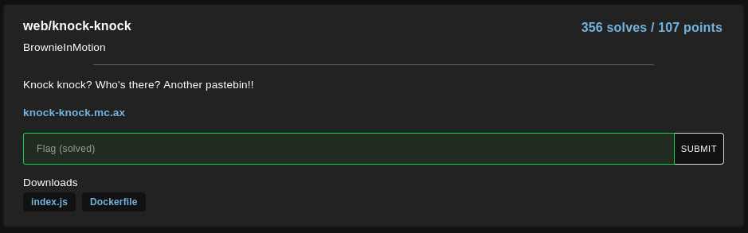
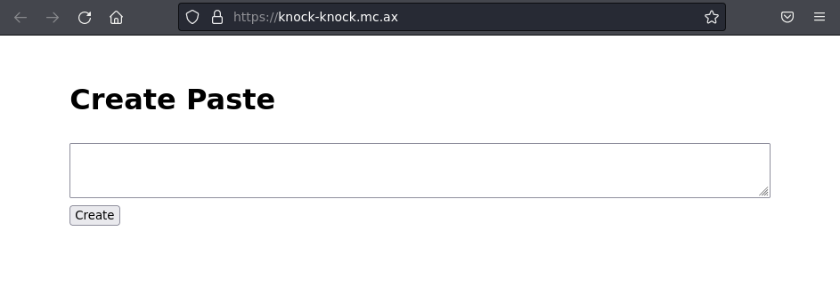
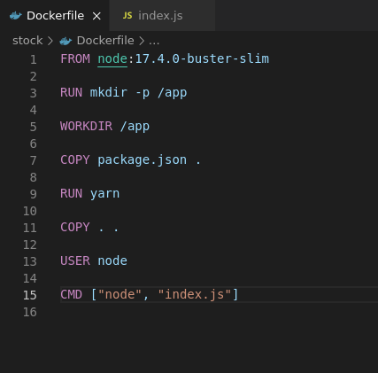
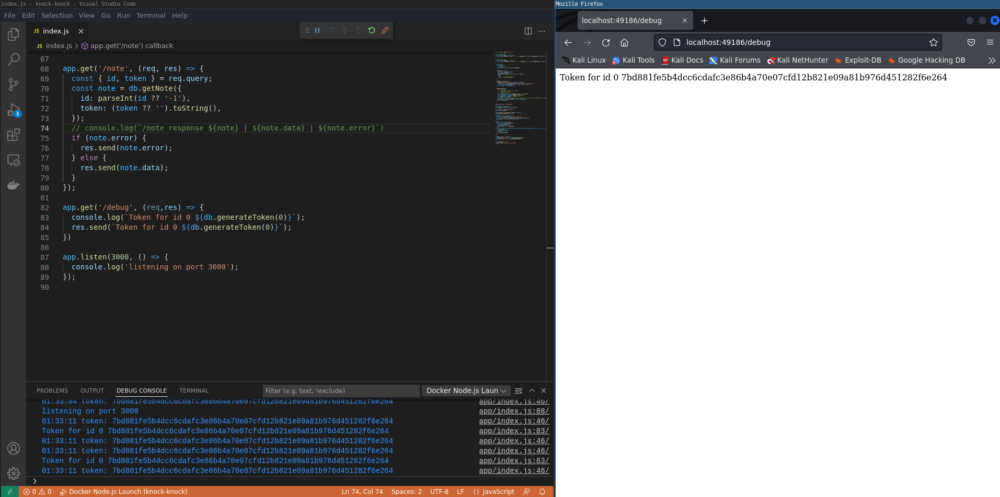
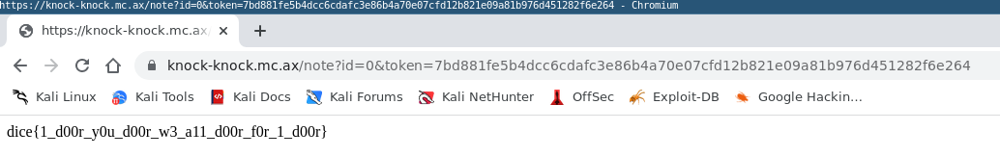

# `DiceCTF 2022`
[Go back](../README.md)<hr/>
# knock-knock



In this challenge we are facing a pastebin-like NodeJS Express web application.



We are provided with the source code along with a Dockerfile (both are crucial to figure out the solution).

In this application we are able to create notes and retrieve them with the corresponding id and token.

```js
app.post('/create', (req, res) => {
  const data = req.body.data ?? 'no data provided.';
  const { id, token } = db.createNote({ data: data.toString() });
  res.redirect(`/note?id=${id}&token=${token}`);
});

app.get('/note', (req, res) => {
  const { id, token } = req.query;
  const note = db.getNote({
    id: parseInt(id ?? '-1'),
    token: (token ?? '').toString(),
  });
  if (note.error) {
    res.send(note.error);
  } else {
    res.send(note.data);
  }
});
```

In particular, the flag we are looking for is stored in the first note of the database:

```js
const db = new Database();
db.createNote({ data: process.env.FLAG });
```

Since the url is only parsed as a string , we are not able to pass objects in the query to possibly bypass the token verification

```js
app.use(express.urlencoded({ extended: false }));
```

Now comes the important part: the database functions

```js
const crypto = require('crypto');

class Database {
  constructor() {
    this.notes = [];
    this.secret = `secret-${crypto.randomUUID}`;
  }

  createNote({ data }) {
    const id = this.notes.length;
    this.notes.push(data);
    return {
      id,
      token: this.generateToken(id),
    };
  }

  getNote({ id, token }) {
    if (token !== this.generateToken(id)) return { error: 'invalid token' };
    if (id >= this.notes.length) return { error: 'note not found' };
    return { data: this.notes[id] };
  }

  generateToken(id) {
    return crypto
      .createHmac('sha256', this.secret)
      .update(id.toString())
      .digest('hex');
  }
}
```

At first glance everything seems to be correct, but there's a critical problem: the secret is not randomly generated at all because `crypto.randomUUID` is not called like a function, but instead represents the source code of the function. This means we are able to generate the token ourselves.

Thanks to the Dockerfile we know the exact nodejs version
```Dockerfile
FROM node:17.4.0-buster-slim
```



We can then proceed to generate the token for the note with id=0

`7bd881fe5b4dcc6cdafc3e86b4a70e07cfd12b821e09a81b976d451282f6e264`



We are then able to retrieve the flag

`dice{1_d00r_y0u_d00r_w3_a11_d00r_f0r_1_d00r}`

